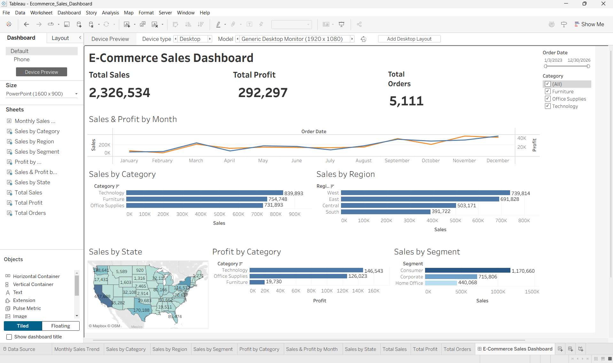
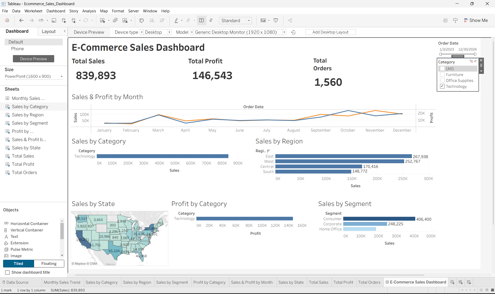

# E-Commerce Sales Analysis Dashboard
## 📊 Project Overview

This project analyzes e-commerce sales data using Tableau to understand sales performance, profitability, regional performance, customer segments, and monthly trends.

An interactive dashboard was developed to present key business insights through charts, KPIs, filters, and a geographic sales map.

## 🎯 Objectives

- Analyze overall sales and profit performance
- Identify the best-performing product categories
- Compare sales across different regions
- Analyze sales by customer segment
- Track monthly sales and profit trends
- Analyze sales performance across states
- Provide an interactive dashboard for business decision-making

## 🛠️ Tools & Technologies

- Tableau
- Microsoft Excel
- Data Visualization
- Business Intelligence

## 📈 Dashboard Features

- Total Sales KPI
- Total Profit KPI
- Total Orders KPI
- Monthly Sales & Profit Trend
- Sales by Category
- Sales by Region
- Sales by Segment
- Profit by Category
- Sales by State Map
- Interactive Order Date Filter
- Interactive Category Filter

## 🔍 Key Insights

- Technology generated the highest sales among the product categories.
- The West region recorded the highest sales among the regions.
- Consumer was the highest-selling customer segment.
- Technology generated the highest profit among the categories.
- Sales and profit trends vary across different months and regions.

## 🖼️ Dashboard Preview



### Interactive Filter View 



## 📁 Project Structure

```text
Ecommerce-Sales-Analysis-Tableau/
│
├── data/
│   └── ecommerce_sales.xlsx
│
├── screenshots/
│   ├── dashboard.png
│   └── dashboard_filter.png
│
├── tableau/
│   └── Ecommerce_Sales_Dashboard.twbx
│
└── README.md
📌 Conclusion
The E-Commerce Sales Analysis Dashboard provides an interactive view of sales and profitability performance. It demonstrates how Tableau can be used to transform raw business data into meaningful visual insights that support data-driven decision-making.
